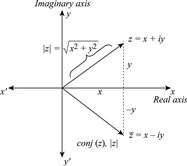
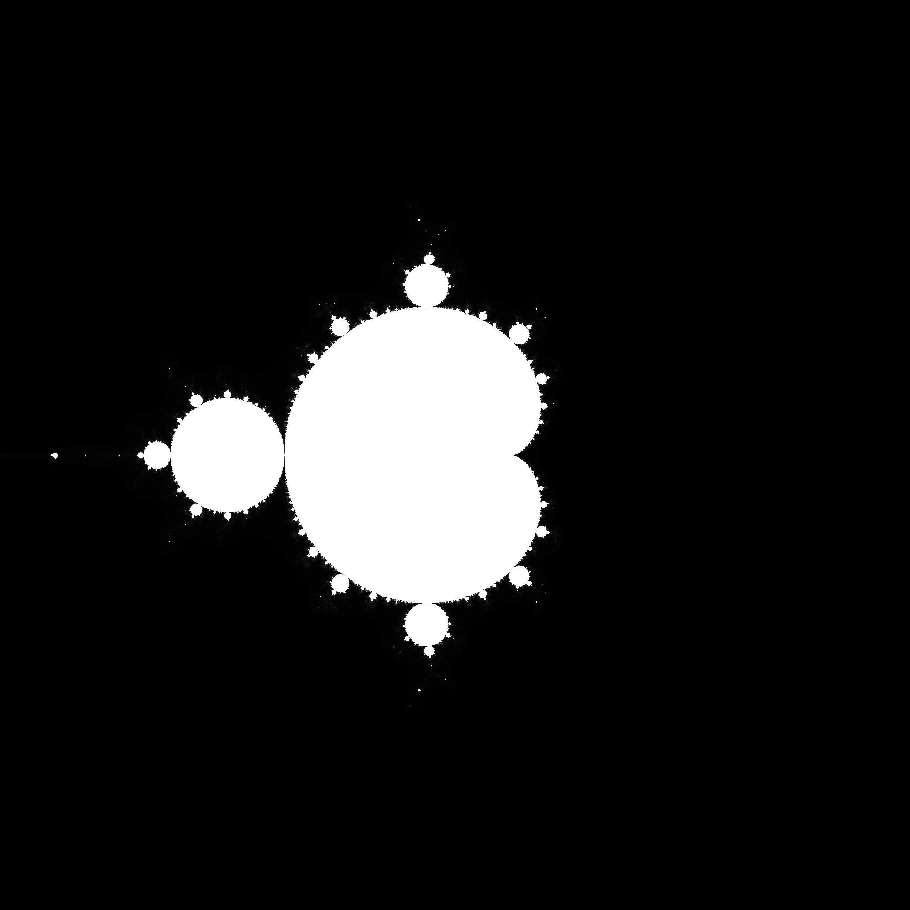

## Parallel Computing for the Mandelbrot Set with OpenMP



Considering that z and c are complex numbers, to generate the Mandelbrot set, you iterate through the equation z-> z\*z + c and map the results to the desired dimensions of the image. The computation is terminated when a maximum number of iterations is achieved or when the set's boundaries are exceeded.

## How to run?

Simply navigate to the relevant folder using terminal and then use the following commands:

```bash
g++ -fopenmp parallel-mandelbrot.cpp -o main.exe
./main.exe
```

After running the program, the file `mandelbrot-canvas.pgm` will be generated. You can view it using any software that can display PGM files or install an extension for this purpose in VSCode, like [PBM/PPM/PGM Viewer for Visual Studio Code](https://marketplace.visualstudio.com/items?itemName=ngtystr.ppm-pgm-viewer-for-vscode).


